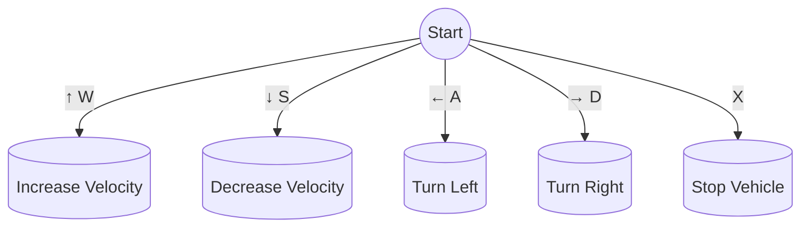

# air_systemTwizy

This repository contains the Central codebase for the AIR team's sd_twizy vehicle, encompassing both simulation models and real-world implementation using ROS2.

<div align="center">


</div>

## Usage Instructions

### Setting Up the Simulation Environment

#### Step 1: Install Docker

Ensure that Docker is installed on your system. You can download it from the official Docker website.

#### Step 2: Clone the repository
Clone the air_systemTwizy repository to your local machine using the following command:

```bash
git clone https://github.com/alunos-pfc/air_systemTwizy.git
```

#### Step 3: Build the Docker image
Navigate to the cloned directory and build the Docker image with the provided Dockerfile:

```bash
cd air_systemTwizy
docker build -t air-twizy -f docker/Dockerfile .
```
### Running the Simulation

#### Step 1: Start the Docker container

Start the Docker container using the run.sh script. Replace <image_name> with the name of the Docker image you want to run:

```bash
./run.sh air-twizy
```
#### Step 2: Launch the simulation

Once inside the container, you can launch the ROS2 simulation environment with the following command:

```bash
ros2 launch air_sim air_simulation.launch.py world_name:=ufg.world gpu:=true
```

Parameters:

- `gpu`: Allows the user to run the PointCloud Process Plugin with GPU usage. Default value is set to `false`
- `rviz`: Open Ros Visualization Tool. Default value is set to `false`.
- `extra_gazebo_args`: Allows the user to visualize the gazebo logs in the launch terminal. Default value must be `--verbose`.


#### Step 3: Control the vehicle

Once the simulation has started, press play in the Gazebo window. 

Open another terminal outside the container and inside the air_systemTwizy directory. Then execute:

```bash
./bash_container.sh
```

Then You can control the vehicle using the keyboard running:

```bash
ros2 run vehicle_control teleop_keyboard.py
```

Follow the instructions bellow to control the vehicle:

<div align="center">



#### Record a Ros2 bag

Once all the processes above are already up and running, open another terminal outside the container and navigate to the `air_systemTwizy` directory. Execute the following commands:

```bash
./bash_container.sh
cd ~/host
ros2 bag record -o <bag_name> /velodyne_points
```
Control the vehicle through the city as you wish and then terminate the process with Ctrl+C. The bag will be stored in the `host` directory, which can be accessed both from within and outside the container.

You can access the bag content running

```
ros2 bag play <path_to_bag>
```

And you can visualize the bag content with rviz by running:

```
rviz2 -d ~/ros2_ws/src/air_systemTwizy/vehicle_simulation/air_sim/config/pcd.rviz
```

NOTE: The command above will only record the `/velodyne_points` ros2 topic. If you want to record all topics, replace /velodyne_points with -a in the ros2 bag record command:

```
ros2 bag record -o <bag_name> -a
```

After recording, you can replay the bag file using the same process described earlier.

To visualize the data from the bag file, follow the same process described above to play it, and then use rviz2 with a specific configuration file. Execute the following command:

```
rviz2 -d ~/ros2_ws/src/air_systemTwizy/vehicle_simulation/air_sim/config/air.rviz
```

</div>

