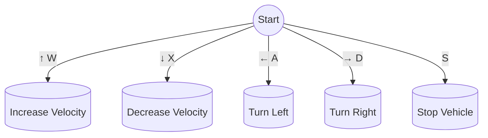

# air_systemTwizy

This repository contains the Central codebase for the AIR team's sd_twizy vehicle, encompassing both simulation models and real-world implementation using ROS2.

<div align="center">


</div>

## Usage Instructions

### Setting Up the Simulation Environment

#### Step 1: Install Docker

Ensure that Docker is installed on your system. You can download it from the official Docker website.

#### Step 2: Clone the repository
Clone the air_systemTwizy repository to your local machine using the following command:

```bash
git clone https://github.com/alunos-pfc/air_systemTwizy.git
```

#### Step 3: Build the Docker image
Navigate to the cloned directory and build the Docker image with the provided Dockerfile:

```bash
cd air_systemTwizy
docker build -t air-twizy -f docker/Dockerfile .
```
### Running the Simulation

#### Step 1: Start the Docker container

Start the Docker container using the run.sh script. Replace <image_name> with the name of the Docker image you want to run:

```bash
./run.sh air-twizy
```
#### Step 2: Launch the simulation

Once inside the container, you can launch the ROS2 simulation environment with the following command:

```bash
ros2 launch air_sim air_simulation.launch.py world_name:=default.world extra_gazebo_args:="--verbose"
```
#### Step 3: Control the vehicle

Once the simulation has started, press play in the Gazebo window. Then You can control the vehicle using the keyboard. In another terminal, run the following command to control the vehicle:

```bash
./bash_container.sh
ros2 run vehicle_control teleop_keyboard.py
```
Then, follow the instructions bellow to control the vehicle:

<div align="center">



</div>

