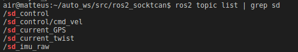

# Integration of vehicle_interface repository to air_systemTwizy

In order to use the vehicle_interface package we have to have the [sd_control](https://github.com/AIR-UFG/TwizyModel/tree/noetic/streetdrone_model/sd_control) plugin working correctly  in the simulation. This plugin is responsible for the communication between the simulation and the vehicle_interface package.

The vehicle_interface package is a ROS package that provides a bridge between the SD-TwizyModel simulation and the [StreetDrone Vehicle API](https://github.com/Monash-Connected-Autonomous-Vehicle/SD-VehicleInterface/tree/8af7517f01aa2fda525c5be29c41080dc984e152).

Tasks:

- [X] Map dependencies and organize structure of the air_systemTwizy repository. 
- [X] Remap IMU and GPS topics in the air_description package to the match vehicle_interface requirements.
- [X] Init vehicle_interface package as submodule in the air_systemTwizy repository and build it. 
- [ ] Migrate sd_control package to ros2.
  - Note: Basically, this is necessary to use the same type of msg that the StreetDrone Vehicle API uses, which is SDcontrol.msg .
  
We can Initiate the vehicle_interface using:

```bash
ros2 launch sd_vehicle_interface sd_vehicle_interface.launch.xml sd_vehicle:=twizy sd_gps_imu:=none sd_simulation_mode:=true 
```

We can see the topics in the simulation using:



